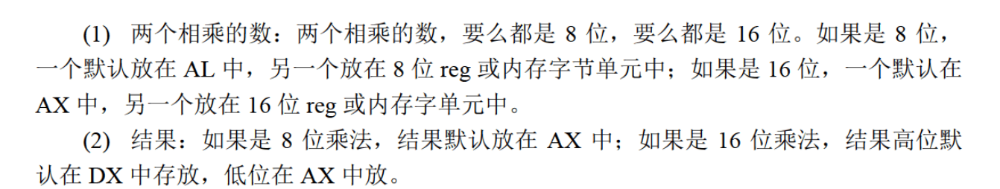

# ret retf
ret
```
(ip) = ((ss) * 16 + (sp))
(sp) = (sp) + 2
```
retf
```
(ip) = ((ss) *  16 + (sp))
(sp) = (sp) + 2
(cs) = ((ss) * 16 + (sp))
(sp) = (sp) + 2
```
ret
```
pop IP
```

retf
```
pop IP
pop CS
```
# call
1. 依据位移进行转移的call指令
`call 标号`
```
push ip
jmp near ptr 标号
```
2. 转移目的地址在指令中的call指令
`call far ptr 标号`
```
push CS
push IP
jmp far ptr 标号
```
3. 转移地址在寄存器中的call指令
`call 16-bit reg`
```
push IP
jmp 
```

4. 转移地址在内存中的call指令
(1). `call word ptr 内存单元地址`
```
push IP
jmp word ptr 内存单元地址
```
e.g.
```
mov sp, 10h
mov ax, 0123h
mov ds:[0], ax
call word ptr ds:[0]
```
执行后, (IP)=0123H, (SP)=0EH

(2). `call dword ptr 内存单元地址`
```
push CS
push IP
jmp dword ptr 内存单元地址
```

# mul
将两个数相乘, 要么都8位, 要么都16位
```
mul reg
mul 内存单元
```
内存单元可以用不同的寻址方式给出, e.g.
```
mul byte ptr ds:[0]
``
`(ax) = (al) *((ds) * 16 + 0)`
```
mul word ptr [bx+si+8]
```
(ax)=(ax)*((ds) * 16 + ())`
```

