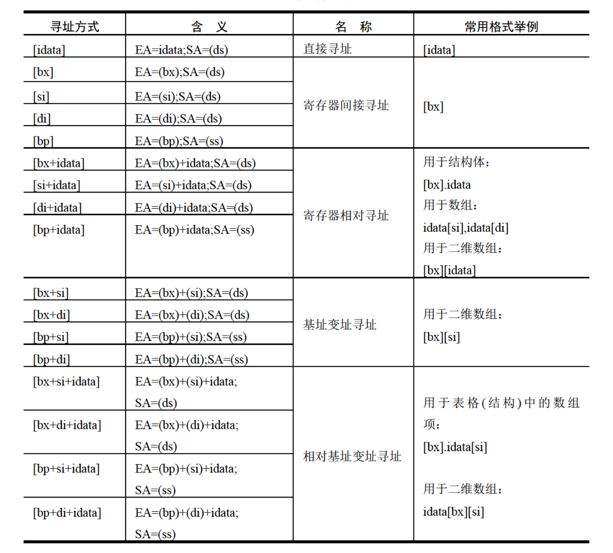

def:
sreg表示段寄存器
reg表示寄存器
以下指令都正确
```
mov ax, [bx]
mov ax, [bx+si]
mov ax, [bx+di]
mov ax, [bp]
mov ax, [bp+si]
mvo ax, [bp+di]
```
...错误
```
mov ax, [cx]
mov ax, [ax]
mov ax, [dx]
mov ax, [ds]
```
以下指令正确
```
mov ax, [bx]
mov ax, [si]
mov ax, [di]
mov ax, [bp]
mov ax, [bx+si]
mov ax, [bx+di]
mov ax, [bp+si]
mov ax, [bp+di]
mov ax, [bp+si+idata]
mov ax, [bx+di+idata]
mov ax, [bp+si+idata]
mov ax, [bp+di+idata]
```
注意, 只要在[...]中使用寄存器, 而指令中没有显性地给出短地址
段地址默认在ss中, 
e.g.
```
mov ax, [bp]
mov ax, [bp+idata]
mov ax, [bp+si]
mov ax, [bp+si+idata]
```
...错误
```
mov ax, [bx+bp]
mov ax, [si+di]
```
## 寻址方式


## 指令要处理的数据有多长?
在没有寄存器名存在的情况下, 用`X ptr`指明内存单元的长度
X = word or byte
e.g.
用word ptr指明访问的内存单元是一个字单元
```
mov word ptr ds:[0], 1
inc word ptr [bx]
inc word ptr ds:[0]
add word pre [bx], 2
```
```
mov byte ptr ds:[0], 1
inc byte ptr [bx]
inc byte ptr ds:[0]
add byte pre [bx], 2
```
# Div指令(被除数/除数)
1. 除数
8-bit or 16-bit, 在一个reg或内存单元中
2. 被除数
除数8位, 被除数16位, 在AX中存放

除数16位, 被除数32位, DX放高16位, AX放低16位

3. 结果
除数8位, AL存放商, AH存储除法操作的余数

除数16位, AX存放除法操作的商, DX存储除法操作的余数

格式
```
div reg
div 内存单元
```
e.g.

```
div byte ptr ds:[0]
```
含义
(al) = (ax) / ((ds) * 16 + 0) 的商

(ah) = (ax) / ((ds) * 16 + 0) 的余数
```
div word ptr es:[0]
```
含义
(ax) = (dx) * 10000H + (ax) / ((es) * 16 + 0) 的商

(dx) = (dx) * 10000H + (ax) / ((es) * 16 + 0) 的余数
```
div byte ptr [bx+si+8]
```
含义
(al) = (ax) / ((ds) * 16 + (bx) + (si) + 8) 的商

(ah) = (ax) / ((ds) * 16 + (bs) + (si) + 8) 的余数
```
div word ptr [bx+si+8] 
```
含义
(ax) = [(dx) * 10000H + (ax)] / ((ds) * 16 + (si) + 8) 的商

(dx) = [(dx) * 10000H + (ax)] / ((ds) * 16 + (si) + 8) 的余数

e.g. 计算100001 / 100时, 由于100001 > 65535, 要用dx和ax存放
186A1H = 100001
```
(dx) = 1H
(ax) = 86A1H
```
伪指令
db 字节型数据, 8-bit 
dw 字型数据, 16-bit
dd dword(double word)双字, 32-bit

dup
```
db 3 dup (0) ; db 0, 0, 0
```
```
db 3 dup (0, 1, 2) ; db 0, 1, 2, 0, 1, 2, 0, 1, 2
```