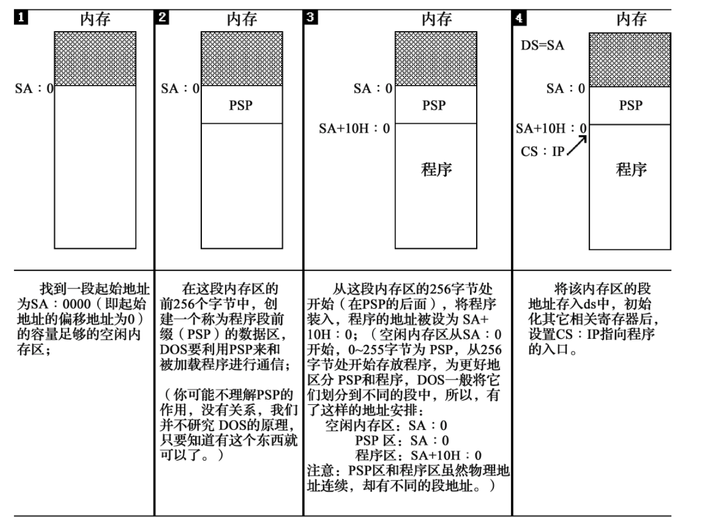

```
assume cs:codesg
codesg segment
       mov ax, 0123H
       mov bx, 0456H
       add ax, bx
       add ax, ax

       mov ax, 4c00H
       int 21H
codesg ends
end
```
其中, mov ax, 4c00H和int 21H表示程序返回
## 1. 伪指令
- segment和ends是成对出现的伪指令, 使用格式为
```
name segment

name ends
```
e.g.
```
codesg segment

codesg ends
```
- end
结束标记, 注意不要混淆ends和end!
- assume
用assume cs:codesg将用作代码段的段codesg和CPU中的段寄存器cs联系起来
exe的执行过程
</img>

> (r)表示寄存器r的值
loop指令的格式: `loop 标号`
要进行两步操作
1. (cx) = (cx) - 1
2. 判断cx中的值, 不为零则转至标号处执行程序.
e.g. 计算2 ^ 12
```
assume cs:code
code segment
    mov ax, 2
    mov cx, 11
s:  add ax, ax
    loop s 
    mov ax, 4c00h
    int 21h      

```