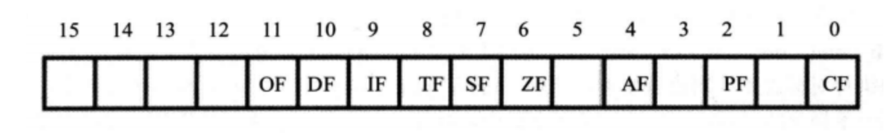
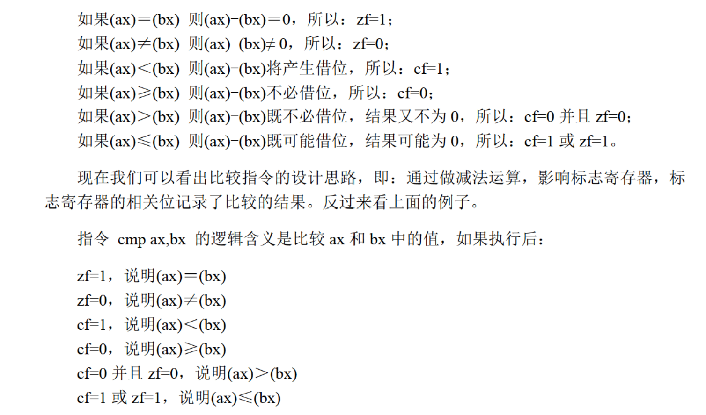
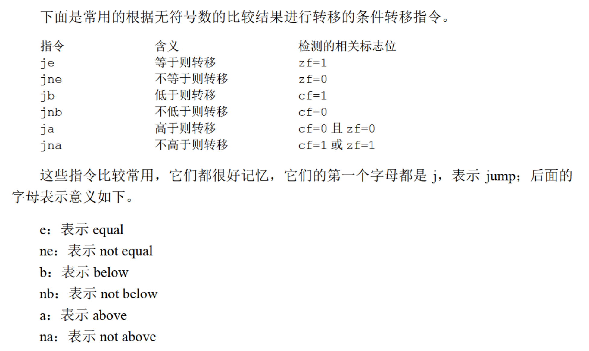
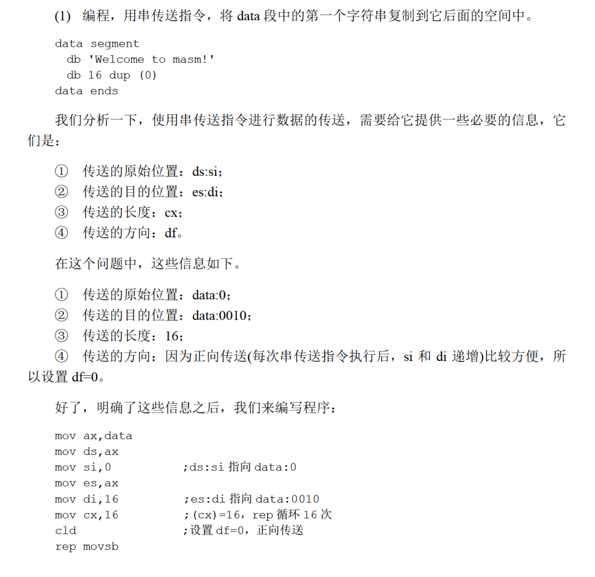
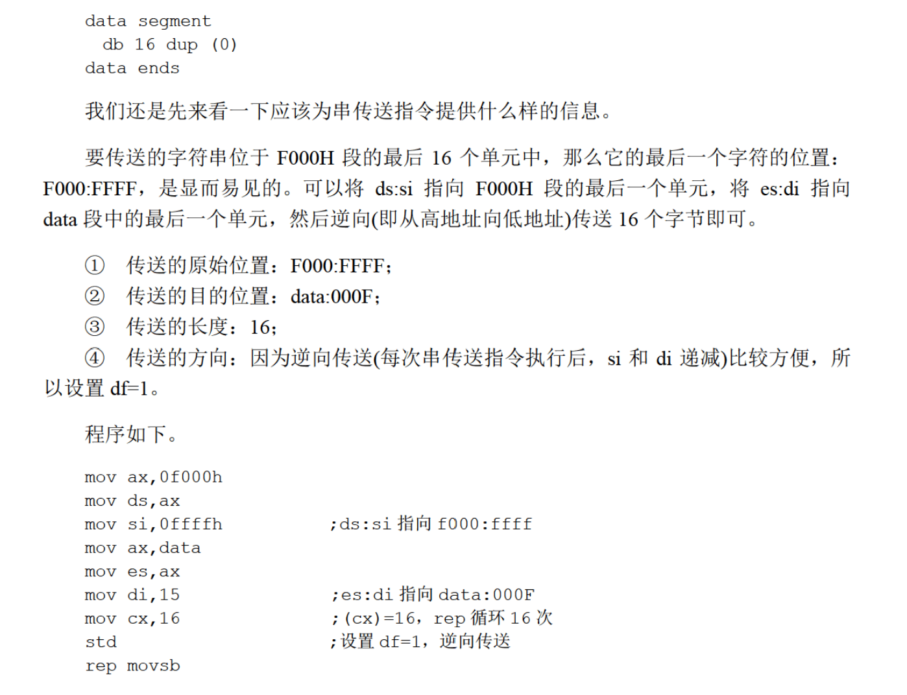
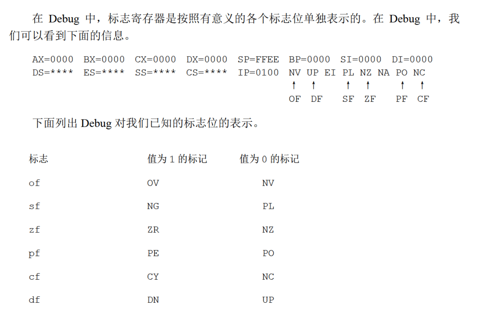

# ZF(Zero Flag)
记载相关指令后结果是否为0
结果为0 -> zf = 1
结果不为0 -> zf = 0
e.g.
```
mov ax, 1
sub ax, 1
```
结果为0, zf = 1
```
mov ax, 2
sub ax, 1
```
结果不为0, zf = 0

# PF(Parity Flag)
奇偶标志位
如果结果所有bit位中1的个数为偶数, pf = 1
否则, pf = 0

# SF(Signed Flag)
判断结果是否为负(如果指令进行的是有符号位的计算)
如果结果为负数, sf = 1
非负, sf = 0
e.g.
```
mov al, 10000001B
add al, 1
```
结果为10000010B, sf = 1, 表示指: <u>如果</u>令进行的是有符号数运算, 
那么结果为负
> 转移指令(mov push pop ...)不影响指令寄存器

# CF(Carry Flag)
对无符号位而言
e.g.
```
mov al, 98H ; 0b10011000
add al, al ; (AL) = 30H, CF = 1
add al, al ; (AL) = 60H, CF = 0
```

# OF(Overflow Flag)
判断溢出, 对有符号位而言
```
mov al, 98
add al, 99
```

# ADC(Add with Carry)
```
adc opt1, opt2
```
opt1 = opt1 + opt2 + CF
e.g. 计算1EF000H+201000H, 结果放在ax(高16位), bx(低16位)
```
mov ax, 001EH
mov bx, 0F000H
add bx, 1000H
adc ax, 0020H
```
# SBB
sbb opt1, opt2
opt1 = opt1 - opt2 - CF

# CMP
```
cmp ax, ax
```
结果不保存在ax中, 只影响flag的相关各位
e.g. `cmp ax, ax`执行后
```
zf = 1, pf = 1, sf = 0, of = 0
```




# DF 
df是flag的第十位, 方向标志位

- df=0 每次操作后si, di递增
- df=1 每次操作后si, di递减

## movsb
`movsb`
```
((es) * 16 + (di)) = ((ds) * 16 + (si))
if df=0:
    (si) = (si) + 1
    (di) = (di) + 1

if df=1:
    (si) = (si) - 1
    (di) = (di) - 1
```
即
```
mov es:[di], byte ptr ds:[si]
if df = 0:
    inc si
    inc di
if df = 1:
    dec si
    dec di
```

`movsw`

```
mov es:[di], byte ptr ds:[si]
if df = 0:
    add si, 2
    add di, 2
if df = 1:
    sub si, 2
    sub di, 2
```
`movsw`和`movsb`都和rep配合使用:
```
rep movsb
```
这等价于
```
s:  movsb
    loop s
```

```
rep movsw
```
等价于
```
s:  movsw
    loop s
```

- `cld`: 将标志寄存器的df位置=0.
- `std`: 将标志寄存器的df位置=1.

e.g.






