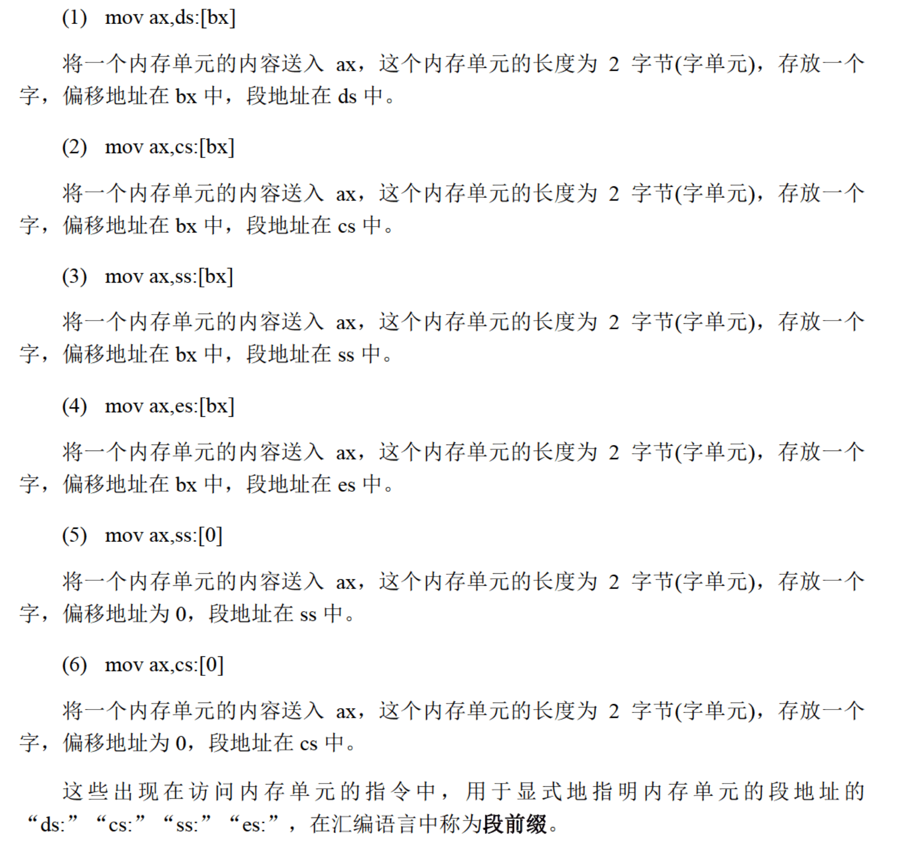

# 1. Loop指令
loop指令的格式: `loop 标号`
要进行两步操作
1. (cx) = (cx) - 1
2. 判断cx中的值, 不为零则转至标号处执行程序.
> 注意: (r)表示寄存器r的值
e.g. 计算2 ^ 12
```
assume cs:code
code segment
    mov ax, 2
    mov cx, 11
s:  add ax, ax
    loop s 
    mov ax, 4c00h
    int 21h      

```
# 2. [bx] 
Debug和汇编编译器对指令的不同解释
在Debug程序中, [0]解释为[0]
在汇编程序中, 编译后[0]解释为0
如何在汇编中将2000:0送入bl寄存器中?
```
mov ax, 2000h
mov ds, ax
mov bx, 0
mov al, [bx]
```
也可以这么写
```
mov ax, 2000h
mov ds, ax
mov al, ds:[0]
```
</img>
