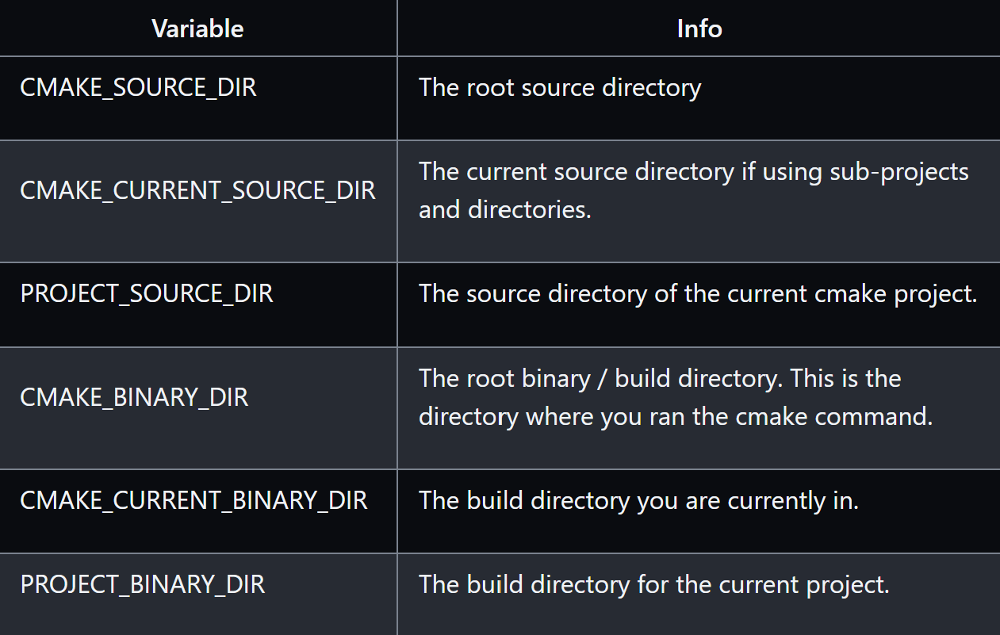

```
B-hello-headers$ tree
.
├── CMakeLists.txt
├── include
│   └── Hello.h
└── src
    ├── Hello.cpp
    └── main.cpp
```

## 1. Source Files Variable
```cmake
# Create a sources variable with a link to all cpp files to compile
set(SOURCES
    src/Hello.cpp
    src/main.cpp
)

add_executable(${PROJECT_NAME} ${SOURCES})
```
Note:An alternative to setting specific file names in the SOURCES variable is to use a GLOB command to find files using wildcard pattern matching.
```cmake
file(GLOB SOURCES "src/*.cpp")
```
## 2. Including Directories

When you have different include folders, you can make your compiler aware of them using the `target_include_directories()` function.When compiling this target this will add these directories to the compiler with the -I flag e.g. `-I/directory/path`
