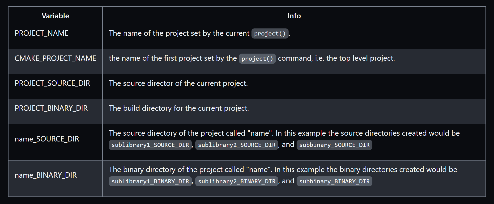

```
$ tree
.
├── CMakeLists.txt
├── subbinary
│   ├── CMakeLists.txt
│   └── main.cpp
├── sublibrary1
│   ├── CMakeLists.txt
│   ├── include
│   │   └── sublib1
│   │       └── sublib1.h
│   └── src
│       └── sublib1.cpp
└── sublibrary2
    ├── CMakeLists.txt
    └── include
        └── sublib2
            └── sublib2.h
```
## Adding a Sub-Directory
```cmake
add_subdirectory(sublibrary1)
add_subdirectory(sublibrary2)
add_subdirectory(subbinary)
```


## Header only Libraries
If you have a library that is created as a <u>header</u> only library.CMake supports the INTERFACE target to allow creating a tartget without any build output.
```
add_library(${PROJECT_NAME} INTERFACE)
```

## Referencing Libraries from Sub-Projects

To create a alias
```cmake
add_library(subbinary2)
add_library(sub::lib2 ALIAS sublibrary2)
target_link_libraries(subbinary sub::lib2)
```
